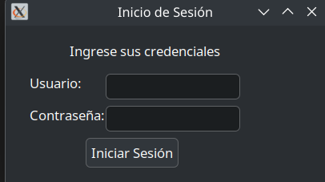
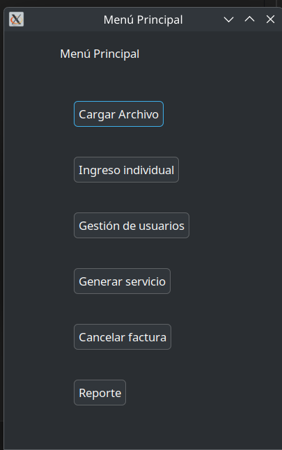
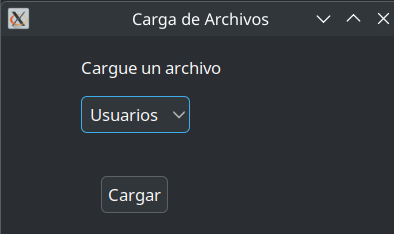
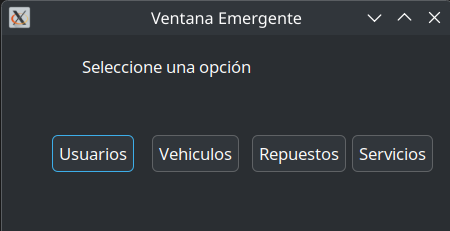
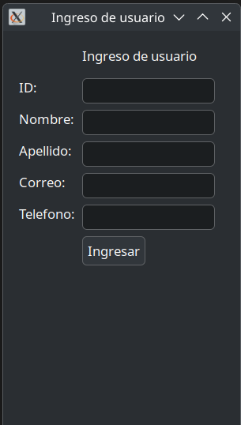
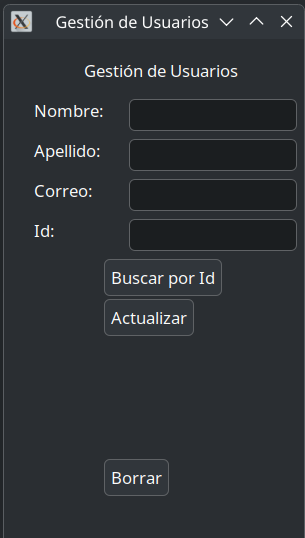
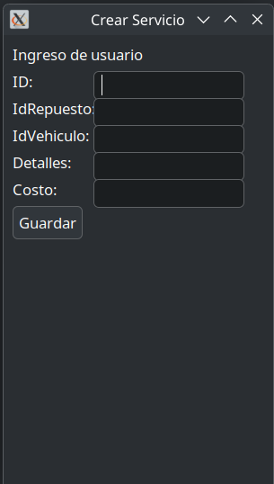
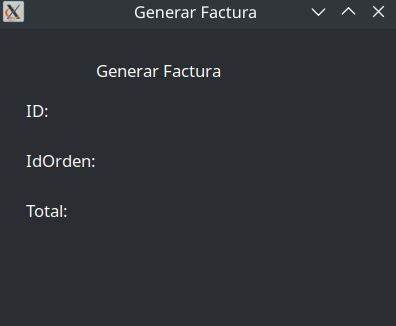

# Manual de usuario
## Inicio de Sesión

En esta ventana encontraras la opcion de ingresar con las credenciales de admin para poder acceder al menú de control del programa

## Menu

Este menu te pfrece diferentes opciones con las cuales interactuar
* Carga Archivo: permite ingresar uno o varios archivos JSON
* Ingreso individual: te permite cargar manualmente nuevos datos.
* Gestion de usuarios: te permite actualizar, encontrar o borrar a un usuario en especifico
* Generar servicio: te permite ingresar un nuevo servicio al igual que generar una factura sobre tu compra
* Carcelar factura: te permite cancelar tu factura generada
* Reportes: genera una serie de graficas cque muestran el contenido de las distintas estructuras de datos del programa

## Carga Masiva

Esta ventana te permite ingresar tres distintos archivos JSON con los cuales cargaras usuarios, vehicuos o repuestos en su respectivo formato.

## Ingreso individual

Esta ventana te muestra cuatro diferentes opciones para ingresar los datos respectivos si es necesario hacerlo manualmente.

## Ingreso usuario

Esta ventana es una muestra de las diferentes cuatro opciones que muestra el Ingreso individual donde podras ingresar cada dato uno por uno

## Gestion Usuario

Esta ventana te permite encontrar, actualizar o borrar a algun usuario ya existente en el programa.

## Generar Servicio

Esta ventana te permite generar un servcio con su respectivo vehiculo y repuesto, además generará una factura en el programa la cual podras cancelar posteriormente y un reporte en forma de matriz con el registo de servicios hechos.

## Cancelar factura

Esta ventana te permite visualizar la factura generada a la hora de realizar un servicio, esta factura se almacenará en forma de pila.