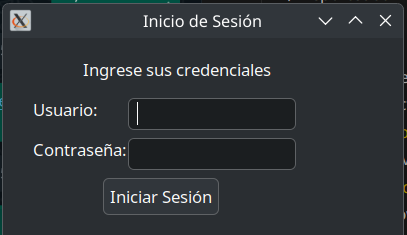
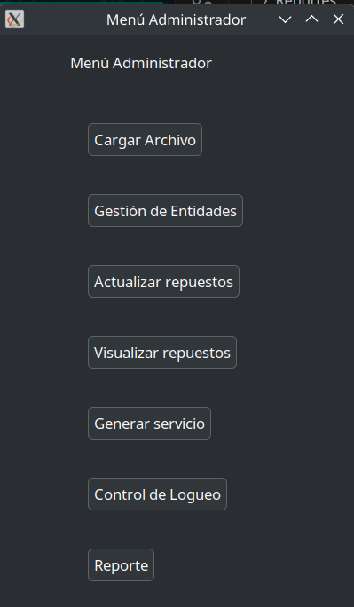
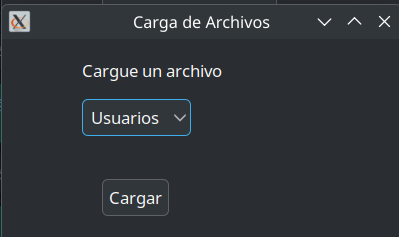
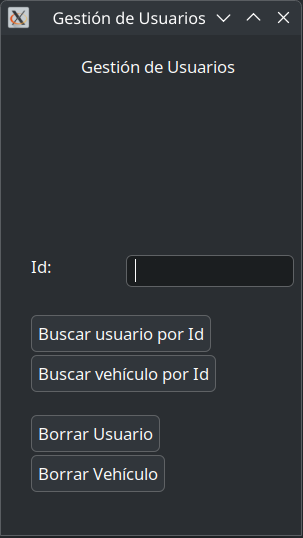
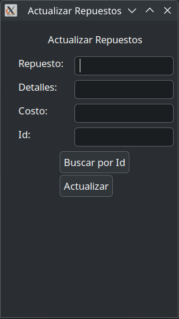
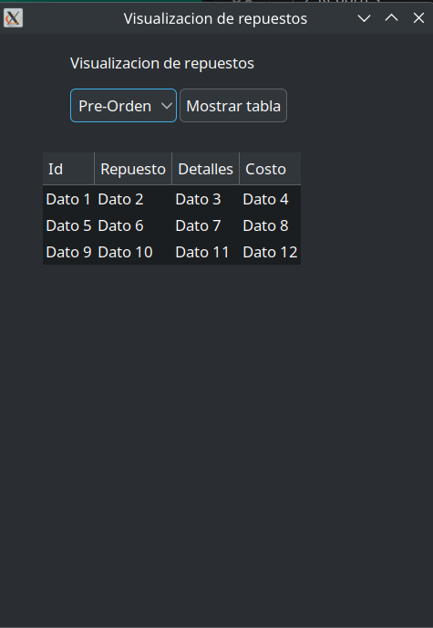
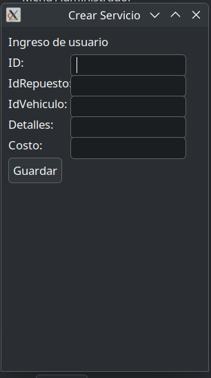
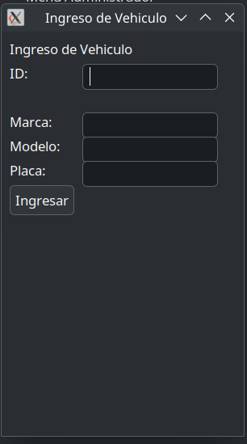
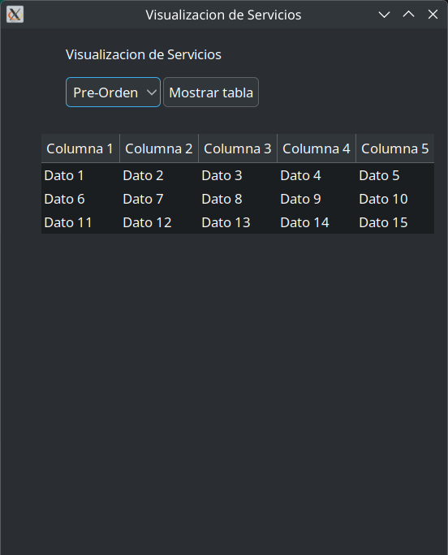
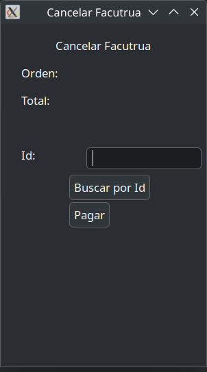

# Inicio de sesion
Pantalla inicial donde los usuarios pueden ingresar sus credenciales para acceder al sistema.

# Menu de Administrador
Interfaz principal para los administradores, con acceso a todas las funcionalidades del sistema.

# Carga Masiva
Ventana para cargar grandes cantidades de datos al sistema mediante archivos.

# Gestión de Entidades
Sección para administrar las entidades del sistema, como usuarios, vehículos y repuestos.

# Actualización de Repuestos
Pantalla para modificar la información de los repuestos disponibles en el sistema.

# Visualización de Repuestos
Interfaz para consultar los repuestos registrados en el sistema.

# Generar Servicios
Ventana para crear y gestionar servicios ofrecidos a los clientes.

# Control de Logueo
Sección para monitorear y registrar los accesos al sistema.

# Generar Reportes
Pantalla para generar reportes detallados sobre las operaciones realizadas en el sistema.

# Menu Usuario
Interfaz principal para los usuarios, con acceso limitado a funcionalidades específicas.

# Insertar Vehiculo
Ventana para registrar nuevos vehículos en el sistema.

# Visualizacion de Servicios
Sección para consultar los servicios realizados o en proceso.

# Visualizacion de Facturas
Pantalla para revisar las facturas generadas por los servicios.

# Cancelar Facturas
Ventana para anular facturas previamente generadas.

