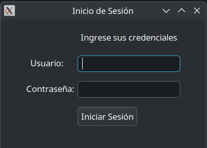
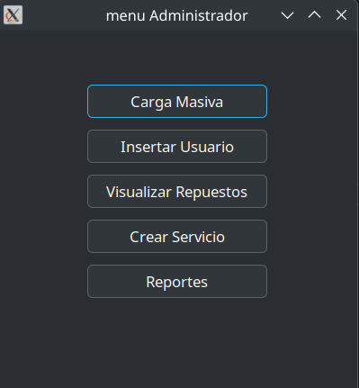
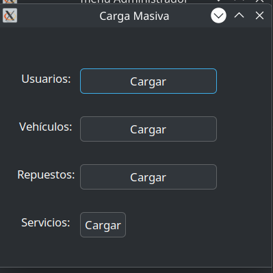
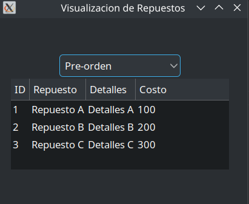
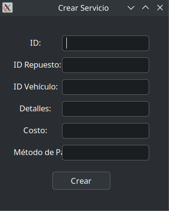
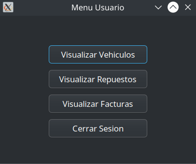
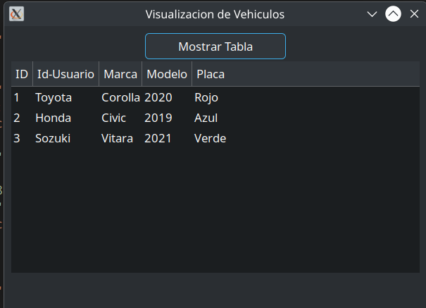
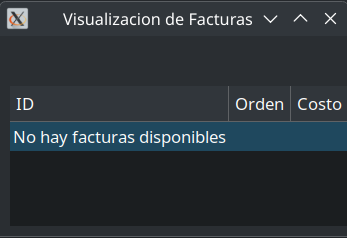
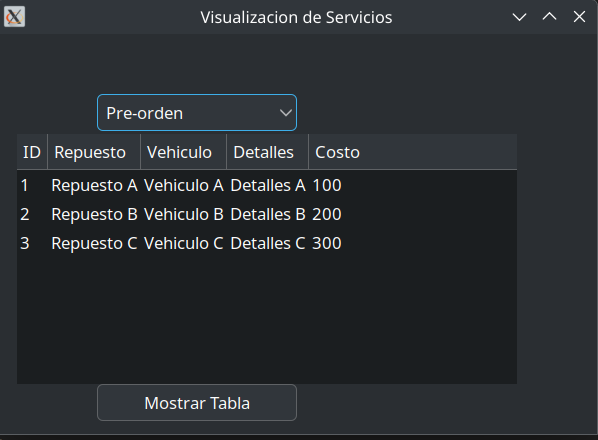

## Funcionalidades del Sistema

---

### 🚪 **Inicio de sesión**  
  
Permite al usuario autenticarse en el sistema mediante el ingreso de su nombre de usuario y contraseña. El sistema valida las credenciales contra la base de datos y, en caso de ser correctas, otorga acceso a las funcionalidades correspondientes según el rol asignado.

---

### 🛠️ **Menú Administrador**  
  
Despliega un panel de navegación exclusivo para administradores, donde se agrupan las funcionalidades de gestión del sistema, como administración de usuarios, repuestos, servicios y generación de reportes. El menú se adapta dinámicamente según los permisos del usuario autenticado.

---

### 📥 **Carga Masiva**  
  
Proporciona una interfaz para la importación de datos en lote mediante archivos en formato CSV o similar. Esta funcionalidad automatiza la inserción de múltiples registros (usuarios, repuestos, etc.) en la base de datos, validando la estructura y el contenido de los archivos antes de su procesamiento.

---

### ➕ **Insertar Usuario**  
  
Permite el registro manual de un nuevo usuario en el sistema. Incluye un formulario para ingresar datos como nombre, correo electrónico, rol y credenciales. El sistema valida la unicidad del usuario y la integridad de los datos antes de almacenarlos.

---

### 🧰 **Visualizar Repuestos**  
  
Muestra una tabla dinámica con el inventario de repuestos disponibles, permitiendo filtrar, buscar y ordenar los registros. Incluye detalles como código, descripción, cantidad en stock y estado de cada repuesto.

---

### 📝 **Crear Servicio**  
  
Facilita el registro de un nuevo servicio, asociando vehículos, repuestos y técnicos responsables. El formulario de creación valida la disponibilidad de recursos y actualiza automáticamente los inventarios y registros relacionados.

---

### 📊 **Reportes**  
Genera informes detallados sobre la operación del sistema, como historial de servicios, movimientos de inventario, usuarios registrados y facturación. Los reportes pueden exportarse en formatos como PDF o Excel y permiten aplicar filtros personalizados.

---

### 👤 **Menú Usuario**  
  
Presenta una interfaz simplificada con las opciones disponibles para usuarios regulares, como consulta de vehículos, servicios y facturas. El menú se ajusta automáticamente según los permisos del usuario.

---

### 🚗 **Visualizar Vehículos**  
  
Permite al usuario consultar la lista de vehículos registrados a su nombre, mostrando información relevante como marca, modelo, año y estado actual. Incluye opciones para filtrar y buscar vehículos específicos.

---

### 🧾 **Visualizar Facturas**  
  
Muestra el historial de facturación del usuario, detallando servicios realizados, costos, fechas y estados de pago. Permite descargar o imprimir las facturas generadas.

---

### 🔍 **Visualizar Servicios**  
  
Permite consultar los servicios realizados o programados, mostrando detalles como fecha, tipo de servicio, repuestos utilizados y técnicos asignados. Incluye opciones para filtrar por estado o rango de fechas.

